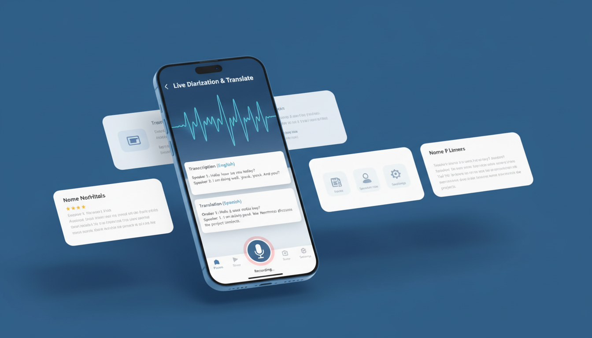

# MedJournee

A privacy-first medical journaling platform for families with language barriers. Live stream diarize: transcribes, translates, and (if the user chooses) summarizes medical conversations OR plain raw transcriptions — then stores them as structured journal entries families can review later.

---



## The Problem

25 million people in the US have limited English proficiency. In medical settings this means:
- Diagnoses and treatment instructions get lost in translation
- Family members can't participate meaningfully in care decisions
- No reliable live-diarize of what was said after the appointment ends

MedJournee gives families a private, accurate live-diarize of their medical conversations in their own language.

---

## How It Works

A family member opens the app before a medical appointment and taps live-diarize. The conversation is transcribed in real time, translated, and after the session, processed through a 5-agent pipeline that produces a structured journal entry with speaker labels, a medical terminology guide, and a plain-language summary.

```
Audio → TranscriptionAgent → DiarizationAgent → TranslationAgent → TerminologyAgent → SummarizationAgent → Journal Entry
```

### The Pipeline

| Agent | What It Does |
|---|---|
| TranscriptionAgent | Real-time speech-to-text via Gladia WebSocket; OpenAI Whisper as fallback |
| DiarizationAgent | Speaker identification via AssemblyAI; matches voices to enrolled family members |
| TranslationAgent | Translates between provider and family languages |
| TerminologyAgent | Flags and explains medical terms using an offline 400+ term UofM dictionary |
| SummarizationAgent | Produces a plain-language summary via GPT-4 |

---

## Features

- Real-time bilingual transcription during the appointment
- Voice enrollment — recognizes enrolled family members by voice
- Post-session diarization — labels who said what
- Medical terminology translation and explanation
- Appointment scheduling and talking points generator
- Cost tracking across API providers
- Full offline app shell (PWA — installable on Android and iOS)
- HIPAA-conscious guardrails: PII detection, audio deletion enforcer, rate limiting

---

## Tech Stack

| Layer | Technology |
|---|---|
| Backend | Python 3.11 / FastAPI / Uvicorn |
| Frontend | PWA — plain HTML/JS, no framework |
| Database | Supabase (PostgreSQL) |
| Transcription | Gladia (live WebSocket) + OpenAI Whisper (HTTP fallback) |
| Diarization | AssemblyAI |
| Translation | deep-translator (Google Translate wrapper) |
| Summarization | OpenAI GPT-4 |
| Voice biometrics | SpeechBrain + PyAnnote |
| Deployment | Render |

---

## Security

- JWT authentication on all endpoints
- Audio upload validation (type allowlist, 50MB limit)
- CORS restricted to explicit methods and headers
- Prometheus `/metrics` endpoint protected by API key
- Pre-commit hooks: detect-secrets, bandit, pip-audit (Loop 1)
- GitHub Actions: CodeQL + Semgrep on every PR (Loop 2)
- Automated dependency CVE monitoring weekly (Loop 4)

---

## Project Structure

```
agents/          5-agent pipeline
guardrails/      HIPAA guardrails (PII, rate limiting, audio deletion)
routes/          FastAPI route handlers
services/        Business logic (transcription, translation, enrollment, costs)
middleware/      JWT authentication
models/          Pydantic schemas
pipeline/        Orchestrator and PipelineState
validators/      Quality gates between pipeline stages
telemetry/       Prometheus metrics
static/          PWA frontend (HTML, CSS, JS, icons)
pwa_docs/        PWA architecture and deployment documentation
tests/           Test suite
```

---

## Deployment

The app runs as a single Render web service — FastAPI serves both the API and the PWA frontend.
